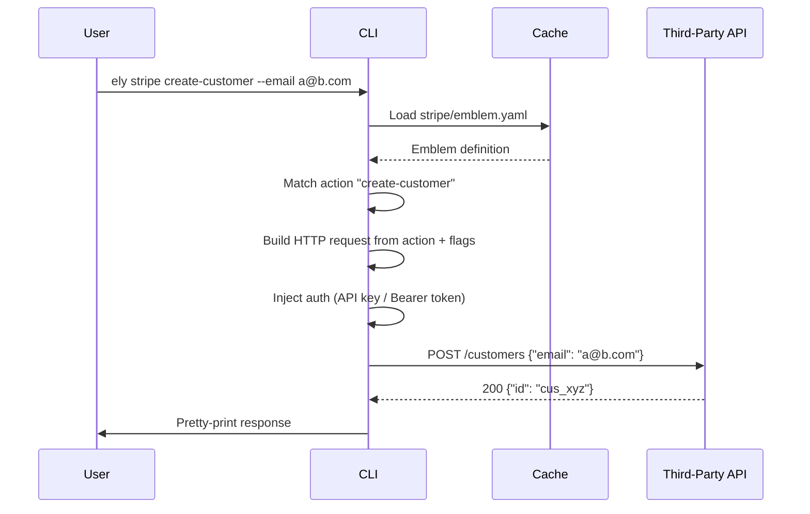
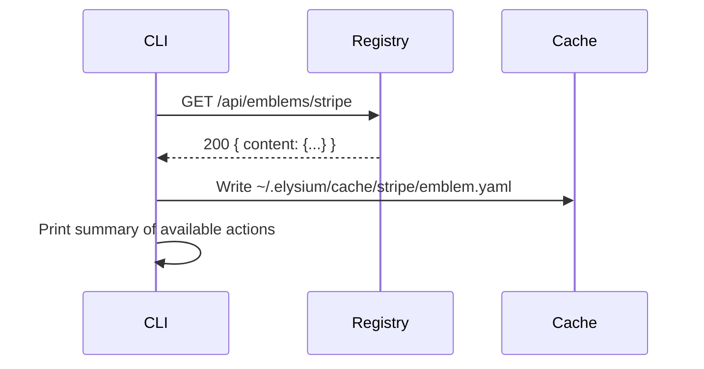
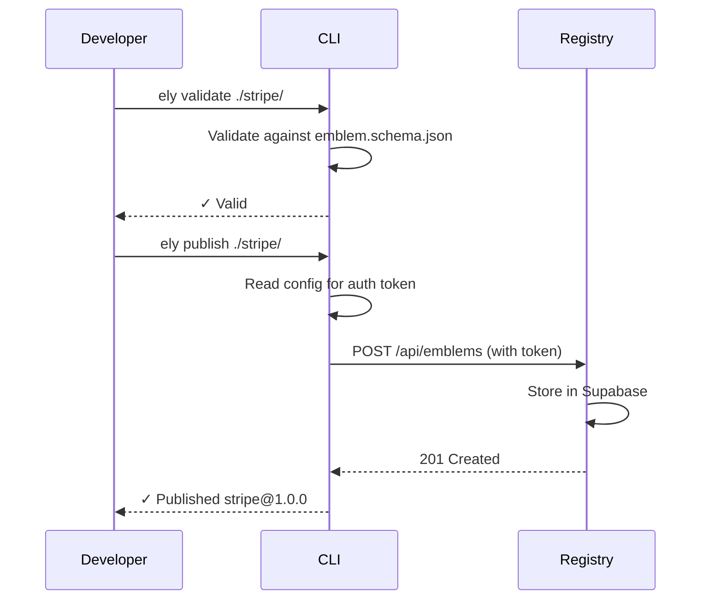

# Architecture

This document describes the technical architecture of Elysium — the API app store.

## Overview

Elysium has three main components that work together:

1. **CLI (`ely`)** — A Go command-line tool that developers use to discover, pull, and execute API emblems.
2. **Registry Server** — A FastAPI backend that stores and serves emblem definitions, backed by Supabase.
3. **Emblems** — YAML files that describe an API's endpoints, authentication, parameters, and types.

```
┌──────────────────────────────────────────────────────────────────┐
│                          Developer / AI Agent                    │
└────────────────────────────┬─────────────────────────────────────┘
                             │  uses
                             ▼
┌──────────────────────────────────────────────────────────────────┐
│                        CLI (ely)                                 │
│                                                                  │
│   ely login          ely pull <name>       ely <name> <action>  │
│   ely search         ely info <name>       ely validate          │
└───────┬──────────────────────────────────────────────────────────┘
        │ HTTP                              │ HTTP (API calls)
        ▼                                  ▼
┌───────────────────┐              ┌───────────────────┐
│  Registry Server  │              │   Third-Party API  │
│  (FastAPI)        │              │   (Stripe, GitHub, │
│                   │              │    Slack, etc.)    │
│  /api/emblems     │              │                   │
│  /api/auth        │              └───────────────────┘
│  /api/search      │
└─────────┬─────────┘
          │
          ▼
┌───────────────────┐
│    Supabase       │
│  (PostgreSQL)     │
│                   │
│  emblems table    │
│  users table      │
│  api_keys table   │
└───────────────────┘
```

## Component Details

### CLI (`ely`)

Written in Go, the CLI is the primary interface for users and AI agents. It is a single statically linked binary.

**Key packages:**

| Package | Purpose |
|---|---|
| `cmd/` | Cobra command definitions (`login`, `pull`, `search`, etc.) |
| `internal/api/` | HTTP client for communicating with the registry server |
| `internal/config/` | Reads and writes `~/.elysium/config.yaml` |
| `internal/emblem/` | YAML parser, validator, and local cache |
| `internal/executor/` | Builds and fires HTTP requests against third-party APIs |

**Local state** is stored in `~/.elysium/`:

```
~/.elysium/
├── config.yaml        # Auth token, server URL, user info
└── cache/
    ├── clothing-shop/
    │   └── emblem.yaml
    └── stripe/
        └── emblem.yaml
```

**Execution flow for `ely <emblem> <action> [flags]`:**



### Registry Server

A Python FastAPI application that stores and retrieves emblem definitions.

**Key files:**

| File | Purpose |
|---|---|
| `app/main.py` | FastAPI app factory, CORS, middleware |
| `app/config.py` | Environment-based settings via Pydantic |
| `app/models.py` | Pydantic request/response models |
| `app/database.py` | Supabase client singleton |
| `app/routes/auth.py` | Login, register, logout, token refresh |
| `app/routes/emblems.py` | CRUD for emblem definitions |
| `app/routes/search.py` | Full-text search over emblems |

**API surface:**

```
GET  /                         # Health check
GET  /docs                     # Interactive OpenAPI docs

POST /api/auth/register        # Create account
POST /api/auth/login           # Get JWT token
POST /api/auth/logout          # Invalidate token
GET  /api/auth/me              # Current user info

GET  /api/emblems              # List emblems (paginated, filterable)
GET  /api/emblems/:name        # Get latest version of an emblem
GET  /api/emblems/:name/:ver   # Get a specific version
POST /api/emblems              # Publish a new emblem (auth required)
PUT  /api/emblems/:name        # Publish a new version (auth required)
DELETE /api/emblems/:name      # Delete an emblem (auth required)

GET  /api/emblems/search       # Search by query, category, tags
```

### Supabase (Database)

Supabase provides a managed PostgreSQL database with built-in auth and Row Level Security.

**Schema (simplified):**

```sql
-- Stores emblem definitions
CREATE TABLE emblems (
    id          UUID PRIMARY KEY DEFAULT gen_random_uuid(),
    name        TEXT NOT NULL,
    version     TEXT NOT NULL,
    description TEXT,
    category    TEXT,
    content     JSONB NOT NULL,   -- The parsed emblem YAML stored as JSON
    author_id   UUID REFERENCES auth.users(id),
    created_at  TIMESTAMPTZ DEFAULT now(),
    updated_at  TIMESTAMPTZ DEFAULT now(),
    UNIQUE(name, version)
);

-- API keys for emblem authors
CREATE TABLE api_keys (
    id          UUID PRIMARY KEY DEFAULT gen_random_uuid(),
    user_id     UUID REFERENCES auth.users(id),
    key_hash    TEXT NOT NULL,
    name        TEXT,
    created_at  TIMESTAMPTZ DEFAULT now()
);
```

### Emblem Format

Emblems are YAML files that describe everything needed to call an API.

```yaml
apiVersion: v1           # Schema version
name: my-api             # Unique identifier in the registry
version: 1.0.0           # SemVer of this emblem
description: My API      # Human-readable description
baseUrl: https://api.example.com

auth:
  type: api_key          # api_key | bearer | basic | oauth2
  keyEnv: MY_API_KEY     # Environment variable holding the credential
  header: X-API-Key      # Header name to use

types:
  Widget:                # Reusable type definitions
    properties:
      id:   { type: integer }
      name: { type: string }

actions:
  list-widgets:          # Action name (used as CLI subcommand)
    description: List all widgets
    method: GET
    path: /widgets
    parameters:
      - name: page
        type: integer
        in: query
```

Full specification: [EMBLEM_SPEC.md](EMBLEM_SPEC.md)

## Data Flow

### Pull flow (`ely pull stripe`)



### Publish flow (`ely publish ./stripe/`)



## Key Design Decisions

### Why Go for the CLI?
- Compiles to a single static binary — no runtime required.
- Starts in under 100 ms — critical for AI agent loops that call `ely` repeatedly.
- Excellent cross-platform support (Linux, macOS, Windows, ARM).
- Strong stdlib for HTTP, file I/O, and concurrency.

### Why FastAPI for the Registry?
- Auto-generated OpenAPI docs are useful for the registry itself being an API.
- Async endpoints allow future real-time features (emblem change notifications).
- Pydantic gives strict validation at the boundary.
- Python's ecosystem makes it easy to add search, ML ranking, etc. later.

### Why Supabase?
- Managed PostgreSQL removes ops burden.
- Built-in auth with JWT and Row Level Security.
- Free tier is sufficient for the current scale.
- Easy to self-host with the open-source Supabase stack if needed.

### Why YAML for Emblems?
- Human-readable and writeable — authors edit these by hand.
- Comments are supported (unlike JSON).
- Widely used in DevOps tooling (Kubernetes, GitHub Actions), so developers are already familiar.
- JSON Schema validation can be applied to the parsed representation.

## Security Architecture

See [SECURITY.md](SECURITY.md) for the full security policy.

Key points:
- JWT tokens are stored in `~/.elysium/config.yaml` (not in the OS keyring yet).
- API credentials (e.g. `STRIPE_API_KEY`) are **never** stored by Elysium; they are read from environment variables at execution time.
- The executor validates all URLs before making requests (http/https only, no `file://` or internal addresses).
- The registry enforces authentication on write operations via Supabase Row Level Security.

## Directory Structure

```
elysium/
├── cli/                    # Go CLI
│   ├── cmd/               # One file per Cobra command
│   ├── internal/
│   │   ├── api/          # Registry HTTP client
│   │   ├── config/       # ~/.elysium state
│   │   ├── emblem/       # YAML parser, validator, cache
│   │   └── executor/     # HTTP request runner
│   └── go.mod
│
├── server/                # FastAPI registry
│   ├── app/
│   │   ├── routes/       # auth.py, emblems.py, search.py
│   │   ├── models.py     # Pydantic schemas
│   │   ├── database.py   # Supabase client
│   │   └── config.py     # Settings
│   └── tests/
│
├── schemas/
│   └── emblem.schema.json # JSON Schema — source of truth for emblems
│
├── examples/
│   ├── clothing-shop/
│   ├── stripe/
│   ├── github/
│   └── slack/
│
├── docs/
│   ├── ARCHITECTURE.md    # This file
│   ├── EMBLEM_SPEC.md     # Full emblem YAML specification
│   ├── GETTING_STARTED.md # User quick-start guide
│   ├── SERVER_SETUP.md    # Deploying the registry server
│   ├── SECURITY.md        # Security policy
│   └── TROUBLESHOOTING.md # Common problems and solutions
│
└── scripts/
    ├── install.sh         # One-line installer
    ├── uninstall.sh       # Uninstaller
    └── build-all.sh       # Cross-platform binary builder
```
