# Elysium Architecture

This document describes the technical architecture of Elysium — the API app store consisting of a **CLI tool** (`ely`), a **Registry Server**, and a **Supabase-backed database**.

---

## Table of Contents

1. [System Overview](#1-system-overview)
2. [CLI Architecture](#2-cli-architecture)
3. [Server Architecture](#3-server-architecture)
4. [Database Schema](#4-database-schema)
5. [Authentication Flows](#5-authentication-flows)
6. [Key Design Decisions](#6-key-design-decisions)
7. [Directory Structure](#7-directory-structure)

---

## 1. System Overview

Elysium has three main components:

| Component | Technology | Responsibility |
|-----------|-----------|----------------|
| **CLI** (`ely`) | Go + Cobra | User-facing tool: login, search, pull, execute emblems |
| **Registry Server** | Python + FastAPI | REST API for managing and serving emblems |
| **Database** | Supabase (PostgreSQL) | Persistent storage for users, emblems, keys, and device codes |

### System Overview Diagram

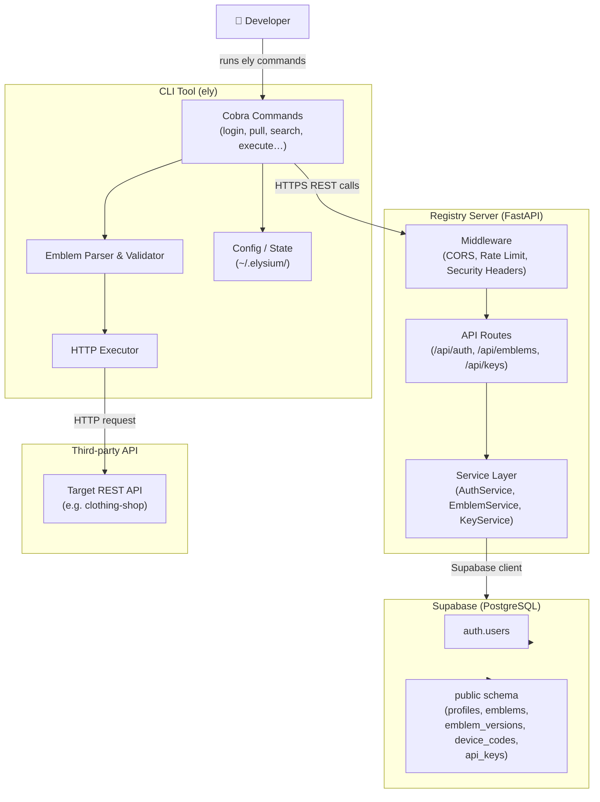

### Data Flow Summary

1. The **developer** runs `ely` commands.
2. The CLI authenticates with the Registry Server and stores tokens locally (`~/.elysium/config.yaml`).
3. To discover or retrieve emblems, the CLI calls the Registry's REST API.
4. To execute an emblem action, the CLI parses the local YAML, builds an HTTP request, and calls the **third-party API** directly — no traffic passes through the Registry at execution time.

---

## 2. CLI Architecture

The CLI is built with [Cobra](https://github.com/spf13/cobra) and organised into commands and internal packages.

### Command Structure

```mermaid
flowchart TD
    Root["ely (root)"]

    Root --> login["login\n(password / device / OAuth)"]
    Root --> logout["logout"]
    Root --> whoami["whoami"]

    Root --> pull["pull <name>[@version]"]
    Root --> update["update &lt;name&gt;"]
    Root --> list["list"]
    Root --> outdated["outdated"]

    Root --> search["search &lt;query&gt;"]
    Root --> info["info &lt;name&gt;"]

    Root --> execute["execute &lt;name&gt; &lt;action&gt;"]
    Root --> validate["validate &lt;file&gt;"]
    Root --> init["init"]

    Root --> keys["keys (list/create/delete)"]
    Root --> config["config"]
    Root --> self_update["self-update"]
    Root --> check_updates["check-updates"]
    Root --> completion["completion"]
```

### Package Organisation

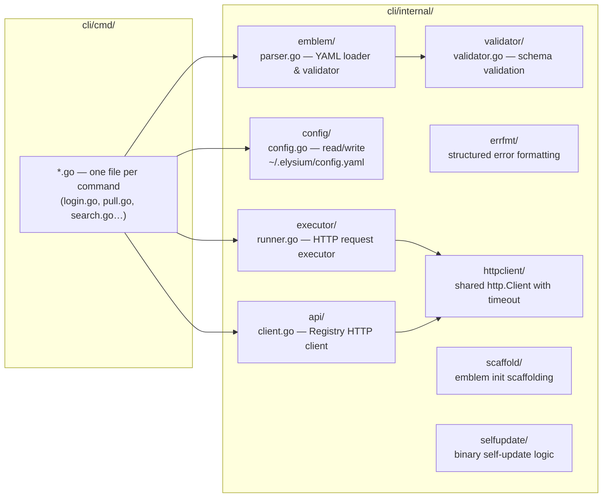

### CLI Data Flow for `ely execute`

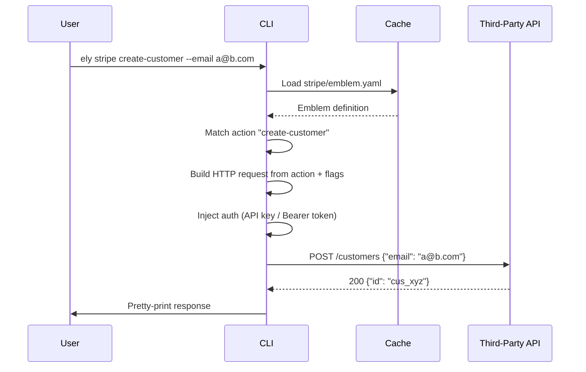

### Local State

Local state is stored in `~/.elysium/`:

```
~/.elysium/
├── config.yaml        # Auth token, server URL, user info
└── cache/
    ├── clothing-shop/
    │   └── emblem.yaml
    └── stripe/
        └── emblem.yaml
```

---

## 3. Server Architecture

The server is a **FastAPI** application deployed on Vercel (serverless) or as a standard ASGI server via Uvicorn/Gunicorn.

### Request Lifecycle

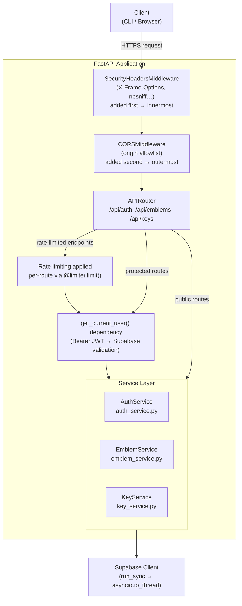

### Route Map

| Prefix | File | Key Endpoints |
|--------|------|---------------|
| `/api/auth` | `routes/auth.py` | `POST /register`, `POST /login`, `POST /logout`, `POST /refresh`, `GET /me`, `PATCH /profile`, `GET /oauth/{provider}/start`, `POST /device/code`, `POST /device/verify`, `POST /device/token` |
| `/api/emblems` | `routes/emblems.py` | `GET /`, `POST /`, `GET /{name}`, `GET /{name}/versions`, `GET /{name}/{version}`, `PUT /{name}`, `DELETE /{name}` |
| `/api/keys` | `routes/keys.py` | `GET /`, `POST /`, `DELETE /{id}` |

### Key Files

| File | Purpose |
|------|---------|
| `app/main.py` | FastAPI app factory, middleware registration |
| `app/config.py` | Environment-based settings via Pydantic |
| `app/models.py` | Pydantic request/response models |
| `app/database.py` | Supabase client singleton and `run_sync()` helper |
| `app/limiter.py` | Rate-limit configuration (slowapi) |
| `app/services/auth_service.py` | Registration, login, OAuth, device-code logic |
| `app/services/emblem_service.py` | CRUD and search for emblems |
| `app/services/key_service.py` | API key lifecycle management |

### Pull & Publish Flows

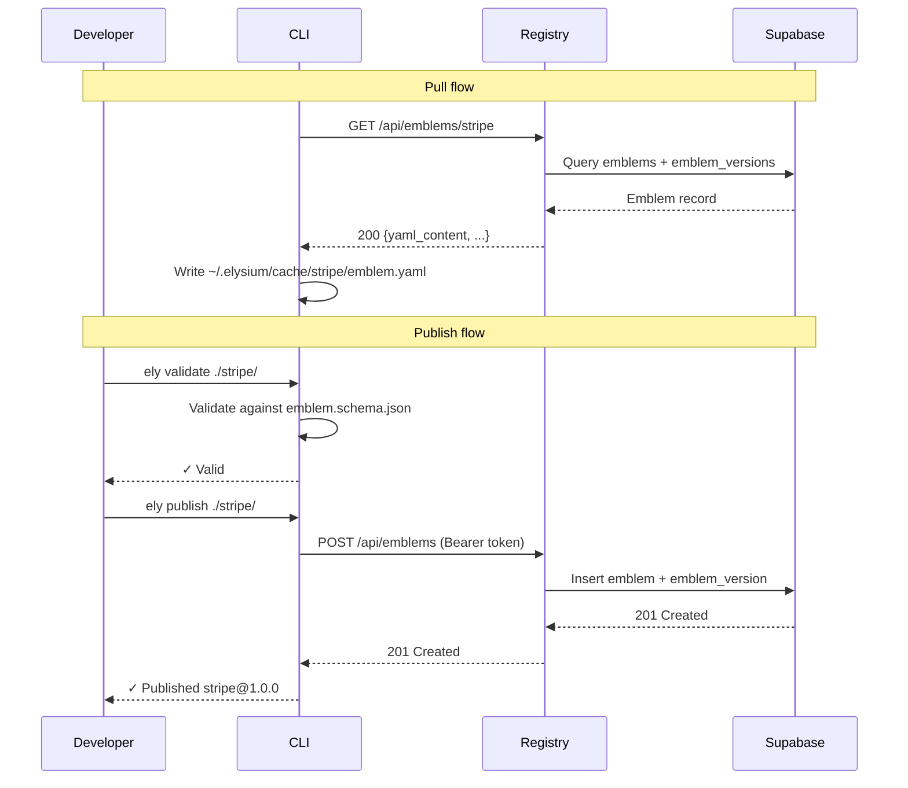

---

## 4. Database Schema

The database is hosted on **Supabase** (PostgreSQL). Row Level Security (RLS) is enabled on all public tables. `auth.users` is managed entirely by Supabase (passwords, JWT issuance) — application code only references it via foreign keys. The `public.profiles` table holds application-level user data and is linked 1-to-1 with `auth.users`.

> **Migration status:** `profiles` is created by `001_profiles_and_search.sql` and `device_codes` by `002_device_codes.sql`. The `emblems`, `emblem_versions`, and `api_keys` tables are referenced in grants and foreign-key constraints within those migrations but their own `CREATE TABLE` DDL is not yet in the migrations directory (pending migration). The schema below reflects the intended complete structure used by the application code.

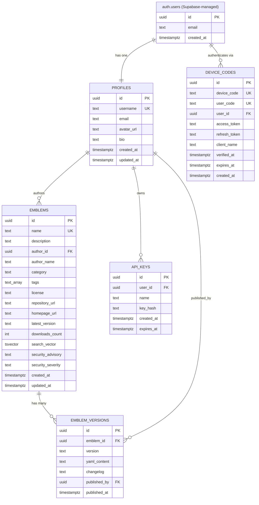

### Key Indexes

| Table | Index | Type | Purpose |
|-------|-------|------|---------|
| `profiles` | `idx_profiles_username` | B-tree | Fast username lookup |
| `profiles` | `idx_profiles_id` | B-tree | Join optimisation |
| `emblems` | `idx_emblems_search` | GIN | Full-text search (`tsvector`) |
| `emblems` | `idx_emblems_author_id` | B-tree | Author queries |
| `device_codes` | `idx_device_codes_device_code` | B-tree | CLI polling |
| `device_codes` | `idx_device_codes_user_code` | B-tree | Browser verification |
| `device_codes` | `idx_device_codes_expires_at` | B-tree | Cleanup queries |

### Full-Text Search

The `search_vector` column on `emblems` is maintained by a PostgreSQL trigger (`emblems_search_trigger`) that combines the emblem `name` (weight A), `description` (weight B), and `tags` (weight C) into a `tsvector`. Search queries use the `search_emblems_fts` RPC function.

---

## 5. Authentication Flows

Elysium supports three authentication mechanisms.

### 5a. Email / Password Flow

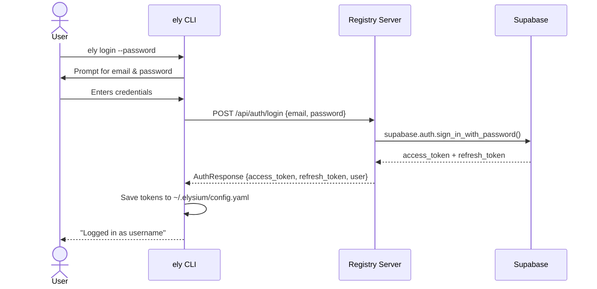

### 5b. Device Code Flow (browser-based CLI login)

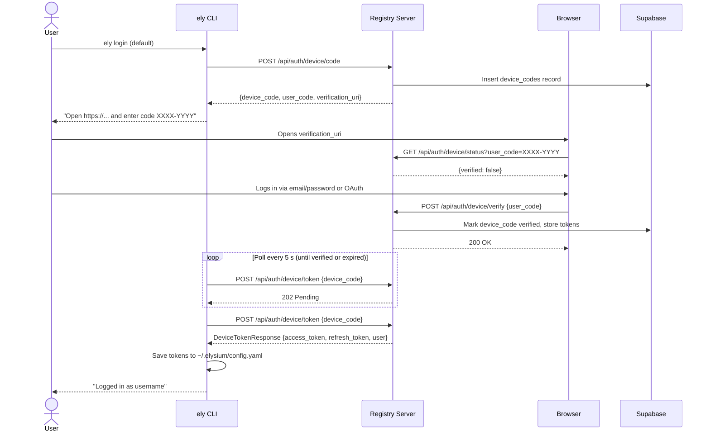

### 5c. OAuth Flow (GitHub / Google)

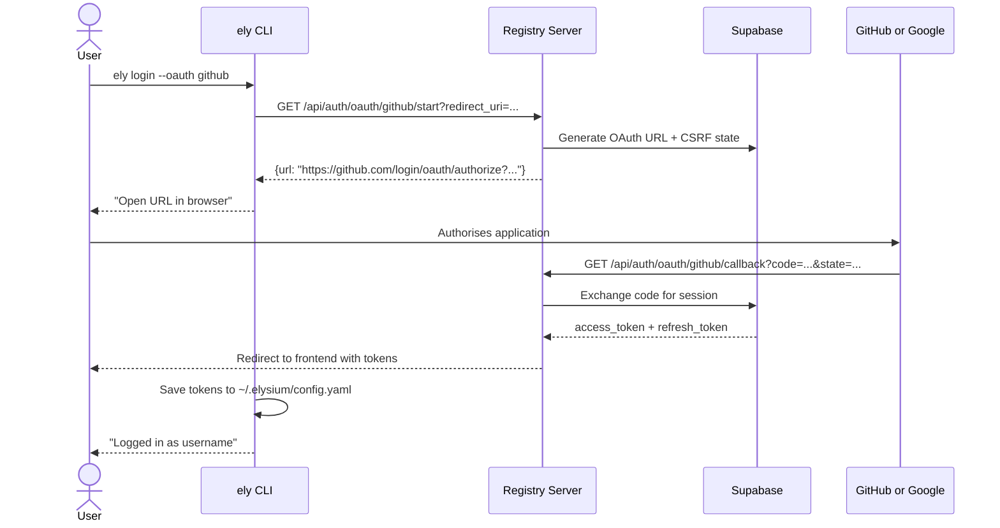

### Token Management

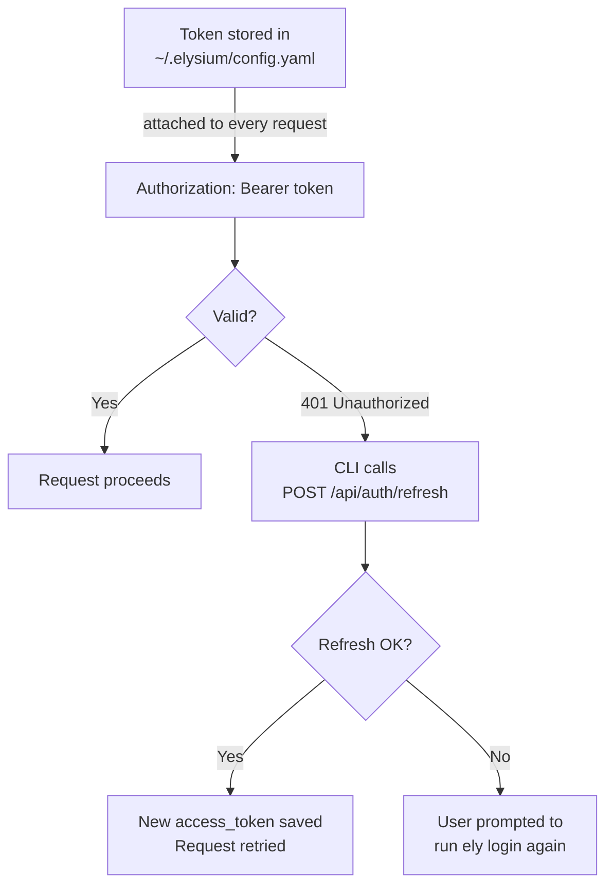

---

## 6. Key Design Decisions

### Why Go for the CLI?
- Compiles to a single static binary — no runtime required.
- Starts in under 100 ms — important for tight feedback loops.
- Excellent cross-platform support (Linux, macOS, Windows, ARM).
- Strong stdlib for HTTP, file I/O, and concurrency.

### Why FastAPI for the Registry?
- Auto-generated OpenAPI docs at `/docs`.
- Async endpoints allow future real-time features (emblem change notifications).
- Pydantic gives strict validation at the request boundary.
- Python's ecosystem makes it easy to add ML-based search ranking later.

### Why Supabase?
- Managed PostgreSQL removes operational burden.
- Built-in auth with JWT and Row Level Security.
- Free tier is sufficient for the current scale.
- Easy to self-host with the open-source Supabase stack if needed.

### Why YAML for Emblems?
- Human-readable and writeable — authors edit these by hand.
- Comments are supported (unlike JSON).
- Widely used in DevOps tooling (Kubernetes, GitHub Actions) — familiar to developers.
- JSON Schema validation can be applied to the parsed representation.

### Security Architecture

Key security properties:

- JWT tokens are stored in `~/.elysium/config.yaml` (file permissions: user-only).
- API credentials (e.g. `STRIPE_API_KEY`) are **never** stored by Elysium; they are read from environment variables at execution time.
- The executor validates all URLs before making requests (http/https only, no `file://` or internal addresses).
- The registry enforces authentication on write operations via Supabase Row Level Security.
- All services catch exceptions and return `500 Internal server error` without exposing internal details.
- Rate limiting is applied per-IP on all public endpoints.

---

## 7. Directory Structure

```
elysium/
├── cli/                    # Go CLI
│   ├── cmd/               # One file per Cobra command
│   ├── internal/
│   │   ├── api/          # Registry HTTP client
│   │   ├── config/       # ~/.elysium state
│   │   ├── emblem/       # YAML parser, validator, cache
│   │   ├── executor/     # HTTP request runner
│   │   ├── validator/    # Schema validation
│   │   ├── errfmt/       # Structured error formatting
│   │   ├── httpclient/   # Shared HTTP client
│   │   ├── scaffold/     # Emblem init scaffolding
│   │   └── selfupdate/   # Binary self-update logic
│   └── go.mod
│
├── server/                # FastAPI registry
│   ├── app/
│   │   ├── routes/       # auth.py, emblems.py, keys.py
│   │   ├── services/     # auth_service.py, emblem_service.py, key_service.py
│   │   ├── models.py     # Pydantic schemas
│   │   ├── database.py   # Supabase client + run_sync()
│   │   ├── config.py     # Settings
│   │   └── limiter.py    # Rate-limit config
│   ├── migrations/       # SQL migration scripts
│   └── tests/
│
├── schemas/
│   └── emblem.schema.json # JSON Schema — source of truth for emblems
│
├── examples/
│   └── clothing-shop/     # Example emblem + API
│
├── docs/
│   ├── ARCHITECTURE.md    # This file
│   ├── EMBLEM_SPEC.md     # Full emblem YAML specification
│   ├── GETTING_STARTED.md # User quick-start guide
│   └── SERVER_SETUP.md    # Deploying the registry server
│
└── scripts/
    ├── install.sh         # One-line installer
    └── build-all.sh       # Cross-platform binary builder
```

Full emblem specification: [EMBLEM_SPEC.md](EMBLEM_SPEC.md)
